# GPU Passthrough Deep Dive: Understanding the Stack

> A comprehensive guide to IOMMU, VFIO, NixOS Specialisations, and QEMU/KVM GPU passthrough — designed for learning and adapting to future VM implementations.

---

## Table of Contents

1. [Overview: The Big Picture](#overview-the-big-picture)
2. [IOMMU: The Foundation](#iommu-the-foundation)
3. [VFIO: The Passthrough Mechanism](#vfio-the-passthrough-mechanism)
4. [NixOS Specialisations: Conditional Boot Configurations](#nixos-specialisations-conditional-boot-configurations)
5. [QEMU/KVM: The Virtualization Stack](#qemukvm-the-virtualization-stack)
6. [OVMF/UEFI: Why BIOS Isn't Enough](#ovmfuefi-why-bios-isnt-enough)
7. [Boot Flow: Step-by-Step](#boot-flow-step-by-step)
8. [Configuration Breakdown](#configuration-breakdown)
9. [Adapting for Other VMs](#adapting-for-other-vms)
10. [Debugging & Troubleshooting](#debugging--troubleshooting)
11. [References](#references)

---

## Overview: The Big Picture

GPU passthrough allows a virtual machine to have **direct, exclusive access** to a physical GPU. Unlike virtual/emulated graphics (VGA, QXL, virtio-gpu), the VM talks directly to the real hardware, achieving near-native performance.

```mermaid
flowchart TB
    subgraph HW["🖥️ PHYSICAL HARDWARE"]
        CPU["CPU<br/>AMD Ryzen 5 1600"]
        RAM["RAM<br/>32 GB"]
        GPU["NVIDIA GPU<br/>GTX 1060"]
        DISK["Storage<br/>/dev/sdb"]
        IOMMU["IOMMU<br/>(AMD-Vi)"]
        
        GPU --> IOMMU
    end
    
    subgraph HOST["🐧 HOST (NixOS)"]
        VFIO["vfio-pci driver<br/>(claims GPU, blocks nvidia)"]
        
        subgraph QEMU["QEMU/KVM"]
            VFIO_DEV["vfio-pci device"]
            RAW_DISK["Raw disk access<br/>/dev/sdb"]
            
            subgraph GUEST["🪟 WINDOWS 11 GUEST"]
                GPU_GUEST["NVIDIA GPU<br/>(native driver)"]
                C_DRIVE["C: Drive<br/>(full disk)"]
            end
        end
    end
    
    IOMMU --> VFIO
    VFIO --> VFIO_DEV
    VFIO_DEV --> GPU_GUEST
    DISK --> RAW_DISK
    RAW_DISK --> C_DRIVE
    
    style HW fill:#1a1a2e,stroke:#16213e,color:#fff
    style HOST fill:#0f3460,stroke:#16213e,color:#fff
    style QEMU fill:#533483,stroke:#16213e,color:#fff
    style GUEST fill:#e94560,stroke:#16213e,color:#fff
```



### Key Components

| Component | Role |
|-----------|------|
| **IOMMU** | Memory isolation between devices and VMs |
| **VFIO** | Linux subsystem for passing devices to userspace (VMs) |
| **vfio-pci** | Driver that "holds" PCI devices for passthrough |
| **KVM** | Linux kernel module for hardware virtualization |
| **QEMU** | Hardware emulator and VM manager |
| **OVMF** | UEFI firmware for VMs (required for GPU passthrough) |
| **Specialisation** | NixOS feature for alternative boot configurations |

---

## IOMMU: The Foundation

### What is IOMMU?

**IOMMU (Input/Output Memory Management Unit)** is a hardware feature that provides memory isolation for devices. It's the CPU/motherboard's way of controlling which memory regions a device can access.

- **AMD implementation:** AMD-Vi (AMD Virtualization for I/O)
- **Intel implementation:** VT-d (Virtualization Technology for Directed I/O)

### Why is IOMMU Required?

Without IOMMU, devices have **unrestricted DMA (Direct Memory Access)** to all system memory. This is dangerous for VMs because:

1. A device in a VM could read/write the host's memory
2. A buggy driver could corrupt other VMs
3. No isolation = no security

**IOMMU solves this by:**
- Creating isolated memory domains
- Mapping guest physical addresses to host physical addresses
- Blocking unauthorized DMA access

### IOMMU Groups

IOMMU groups are sets of devices that **cannot be isolated from each other**. If two devices share an IOMMU group, they must both be passed to the same VM (or stay on the host).

```bash
# Check your IOMMU groups
for d in /sys/kernel/iommu_groups/*/devices/*; do
  n=${d#*/iommu_groups/*}; n=${n%%/*}
  printf 'IOMMU Group %s: ' "$n"
  lspci -nns "${d##*/}"
done | sort -V
```

**Ideal scenario:** Your GPU and its audio device are in their own IOMMU group (no other devices). This is what we have:

```
IOMMU Group 15: 26:00.0 VGA compatible controller [0300]: NVIDIA GeForce GTX 1060 [10de:1c03]
IOMMU Group 15: 26:00.1 Audio device [0403]: NVIDIA GP106 High Definition Audio [10de:10f1]
```

### Enabling IOMMU

In NixOS, add the kernel parameter:

```nix
boot.kernelParams = [ "amd_iommu=on" ];  # AMD
# or
boot.kernelParams = [ "intel_iommu=on" ]; # Intel
```

Verify it's active:

```bash
sudo dmesg | grep -i -E "iommu|amd-vi"
# Should show: "AMD-Vi: Interrupt remapping enabled"
```

---

## VFIO: The Passthrough Mechanism

### What is VFIO?

**VFIO (Virtual Function I/O)** is a Linux kernel framework that allows userspace programs (like QEMU) to directly access hardware devices safely and securely.

### VFIO Components

| Module | Purpose |
|--------|---------|
| `vfio` | Core framework |
| `vfio_pci` | PCI device passthrough driver |
| `vfio_iommu_type1` | IOMMU support for memory isolation |

### How vfio-pci Works

The `vfio-pci` driver is a **stub driver** that:

1. Claims the device (prevents other drivers from loading)
2. Provides a userspace interface (`/dev/vfio/...`)
3. Allows QEMU to control the device directly


### Binding a Device to vfio-pci

There are multiple ways to bind a device. We use the **kernel parameter method** (earliest possible binding):

```nix
# Method 1: Kernel parameter (best for GPU passthrough)
boot.kernelParams = [ "vfio-pci.ids=10de:1c03,10de:10f1" ];

# Method 2: Modprobe config (backup)
boot.extraModprobeConfig = ''
  options vfio-pci ids=10de:1c03,10de:10f1
'';
```

The `10de:1c03` is the **PCI vendor:device ID**. Find yours with:

```bash
lspci -nn | grep -i nvidia
# 26:00.0 VGA compatible controller [0300]: NVIDIA ... [10de:1c03]
```

### Driver Race Condition

The nvidia driver and vfio-pci both want to claim the GPU. We need vfio-pci to win:

```nix
# Blacklist nvidia driver
boot.blacklistedKernelModules = [ "nvidia" "nvidia_modeset" "nvidia_uvm" "nvidia_drm" ];

# Soft dependency: if nvidia tries to load, load vfio-pci first
boot.extraModprobeConfig = ''
  softdep nvidia pre: vfio-pci
'';
```

Verify vfio-pci is bound:

```bash
lspci -nnk -d 10de:1c03
# Kernel driver in use: vfio-pci  ← This means it worked!
```

---

## NixOS Specialisations: Conditional Boot Configurations

### What are Specialisations?

**Specialisations** are NixOS's way of creating **alternative system configurations** that share the same base but have different settings. Each specialisation creates a separate GRUB entry.

### Why Use Specialisations for GPU Passthrough?

We need **mutually exclusive configurations**:

| Normal Boot | VM Boot |
|-------------|---------|
| nvidia driver loaded | nvidia blacklisted |
| greetd starts Hyprland | greetd disabled |
| GPU used for desktop | GPU bound to vfio-pci |

Without specialisations, we'd need two separate NixOS installations.

### How Specialisations Work

```nix
# Base configuration (always applied)
{
  boot.kernelParams = [ "amd_iommu=on" ];  # Shared
  services.greetd.enable = true;           # Default
  
  # Specialisation: only applied when selected in GRUB
  specialisation.windows-vm.configuration = {
    system.nixos.tags = [ "windows-vm" ];  # GRUB label
    
    # Override base settings
    services.greetd.enable = lib.mkForce false;
    boot.blacklistedKernelModules = [ "nvidia" ... ];
    # ... VM-specific config
  };
}
```

### Key Functions

| Function | Purpose |
|----------|---------|
| `lib.mkForce` | Override a value, ignoring previous settings |
| `lib.mkDefault` | Set a default that can be overridden |
| `lib.mkMerge` | Merge multiple attribute sets |

### Resulting GRUB Menu

```mermaid
flowchart LR
    subgraph GRUB["🖥️ GNU GRUB Boot Menu"]
        direction TB
        OPT1["▶ NixOS"]
        OPT2["&nbsp;&nbsp;NixOS - windows-vm"]
        OPT3["&nbsp;&nbsp;NixOS (Generation 42)"]
    end
    
    OPT1 -->|"Normal desktop"| DESKTOP["🖥️ Hyprland Desktop"]
    OPT2 -->|"GPU passthrough"| VM["🪟 Windows VM"]
    
    style GRUB fill:#1a1a2e,stroke:#4a4e69,color:#fff
    style OPT1 fill:#e94560,stroke:#fff,color:#fff
    style OPT2 fill:#533483,stroke:#fff,color:#fff
    style OPT3 fill:#533483,stroke:#fff,color:#fff
```



---

## QEMU/KVM: The Virtualization Stack

### The Stack

```mermaid
flowchart TB
    subgraph STACK["Virtualization Stack"]
        direction TB
        GUEST["🪟 Guest OS (Windows 11)"]
        
        subgraph QEMU_LAYER["QEMU (Hardware Emulation)"]
            Q1["CPU emulation, device models"]
            Q2["VFIO device passthrough"]
            Q3["VNC/SPICE display"]
        end
        
        subgraph KVM_LAYER["KVM (Kernel Module)"]
            K1["Hardware virtualization (AMD-V)"]
            K2["Memory management (NPT)"]
            K3["Interrupt virtualization"]
        end
        
        KERNEL["🐧 Linux Kernel"]
        HW["🖥️ Hardware (AMD CPU)"]
    end
    
    GUEST --> QEMU_LAYER
    QEMU_LAYER --> KVM_LAYER
    KVM_LAYER --> KERNEL
    KERNEL --> HW
    
    style GUEST fill:#e94560,stroke:#fff,color:#fff
    style QEMU_LAYER fill:#533483,stroke:#fff,color:#fff
    style KVM_LAYER fill:#0f3460,stroke:#fff,color:#fff
    style KERNEL fill:#1fab89,stroke:#fff,color:#fff
    style HW fill:#1a1a2e,stroke:#fff,color:#fff
```



### KVM (Kernel-based Virtual Machine)

KVM turns Linux into a **Type-1 hypervisor**. It uses hardware virtualization extensions (AMD-V / Intel VT-x) for near-native performance.

Check KVM support:

```bash
lscpu | grep -i virtualization
# Virtualization: AMD-V

ls /dev/kvm
# /dev/kvm  ← KVM is available
```

### QEMU Machine Types

We use the `q35` machine type:

```bash
-machine q35,accel=kvm
```

| Machine | PCIe Support | Use Case |
|---------|--------------|----------|
| `pc` (i440fx) | No | Legacy, maximum compatibility |
| `q35` | Yes | Modern, required for GPU passthrough |

### QEMU CPU Configuration

```bash
-cpu host,kvm=on
```

- `host`: Pass through the real CPU model (best performance)
- `kvm=on`: Enable KVM acceleration

### Memory Configuration

```bash
-m 16G
```

Allocates 16GB RAM to the VM. For hugepages (better performance):

```nix
# In NixOS configuration
boot.kernelParams = [ "default_hugepagesz=1G" "hugepagesz=1G" "hugepages=16" ];
```

---

## OVMF/UEFI: Why BIOS Isn't Enough

### The Problem with SeaBIOS

Traditional QEMU uses **SeaBIOS** (legacy BIOS). GPUs have firmware (VBIOS/GOP) designed for UEFI, not legacy BIOS. GPU passthrough with SeaBIOS often fails or causes:

- Black screens
- GPU initialization errors
- Missing UEFI GOP (Graphics Output Protocol)

### OVMF: UEFI for VMs

**OVMF (Open Virtual Machine Firmware)** is an open-source UEFI implementation based on **EDK2** (EFI Development Kit). It provides:

- UEFI boot for VMs
- Secure Boot support (optional)
- NVRAM variables storage

### OVMF Files

| File | Purpose |
|------|---------|
| `edk2-x86_64-code.fd` | UEFI firmware code (read-only) |
| `edk2-i386-vars.fd` | NVRAM variables template |
| `windows11_VARS.fd` | Per-VM NVRAM copy (writable) |

### Understanding UEFI NVRAM (The VARS File)

UEFI systems have **NVRAM (Non-Volatile RAM)** — a small piece of persistent storage that survives reboots. On physical machines, this is a chip on the motherboard. In VMs, it's emulated as a file.

#### What's Stored in NVRAM?

| Data | Purpose |
|------|---------|
| **Boot order** | Which device to boot first (HDD, USB, Network) |
| **Boot entries** | Paths to bootloaders (e.g., `\EFI\Microsoft\Boot\bootmgfw.efi`) |
| **Secure Boot keys** | Platform Key (PK), Key Exchange Keys (KEK), DB/DBX |
| **UEFI variables** | Settings from OS and firmware |
| **Hardware configuration** | Device-specific settings |

#### The Two OVMF Files Explained


#### Why Separate CODE and VARS?

**Security & Integrity:**
- The firmware code should **never change** — if malware modified it, your VM could be compromised
- Making CODE read-only prevents firmware-level attacks

**Flexibility:**
- Each VM needs **its own writable NVRAM** to store its boot configuration
- Windows installs its bootloader and writes to NVRAM
- If VMs shared VARS, they'd overwrite each other's boot entries

#### What Happens During Windows Installation?


#### Why Each VM Needs Its Own Copy

```bash
# WRONG - sharing the template (VMs would corrupt each other)
-drive if=pflash,format=raw,file=/run/.../edk2-i386-vars.fd  # ❌

# CORRECT - each VM has its own copy
-drive if=pflash,format=raw,file=/var/lib/.../windows11_VARS.fd  # ✅
-drive if=pflash,format=raw,file=/var/lib/.../linux_VARS.fd      # ✅
```

#### What Happens If You Delete the VARS File?

If you deleted `windows11_VARS.fd` and recreated it from the template:

```bash
# This would RESET the VM's UEFI settings
sudo cp /run/current-system/sw/share/qemu/edk2-i386-vars.fd \
        /var/lib/libvirt/qemu/nvram/windows11_VARS.fd
```

**Result:** Windows wouldn't boot! The NVRAM would be empty — no boot entry for Windows. You'd see the UEFI shell or "No bootable device" error.

#### Physical PC Analogy

| Physical PC | Virtual Machine |
|-------------|-----------------|
| BIOS chip (firmware code) | `edk2-x86_64-code.fd` |
| CMOS battery-backed memory | `windows11_VARS.fd` |
| "Reset BIOS to defaults" | Delete VARS, copy from template |

### QEMU OVMF Configuration

```bash
# Firmware (read-only) - shared by all VMs
-drive if=pflash,format=raw,readonly=on,file=/path/to/edk2-x86_64-code.fd

# NVRAM (writable) - unique per VM
-drive if=pflash,format=raw,file=/var/lib/libvirt/qemu/nvram/windows11_VARS.fd
```

### Creating the NVRAM File

```bash
# Create directory for VM NVRAM files
sudo mkdir -p /var/lib/libvirt/qemu/nvram

# Copy template to create VM-specific NVRAM
sudo cp /run/current-system/sw/share/qemu/edk2-i386-vars.fd \
        /var/lib/libvirt/qemu/nvram/windows11_VARS.fd

# Make it writable by QEMU
sudo chmod 644 /var/lib/libvirt/qemu/nvram/windows11_VARS.fd
```

> **Tip:** Back up your VARS file after Windows is installed! If it gets corrupted, you can restore it without reinstalling Windows.

---

## Boot Flow: Step-by-Step

### Normal Boot (Desktop)

```
1. GRUB loads "NixOS" entry
2. Kernel loads with: amd_iommu=on nvidia_drm.modeset=1
3. initrd loads nvidia module
4. nvidia driver claims GPU
5. systemd starts greetd
6. greetd runs tuigreet → Hyprland
7. Desktop session begins
```

### VM Boot (Passthrough)

```
1. GRUB loads "NixOS - windows-vm" entry
2. Kernel loads with: amd_iommu=on vfio-pci.ids=10de:1c03,10de:10f1
3. initrd loads vfio_pci, vfio, vfio_iommu_type1
4. vfio-pci claims GPU (nvidia blacklisted)
5. systemd starts multi-user.target (no greetd)
6. systemd starts windows-vm.service
7. QEMU launches with GPU passthrough
8. Windows 11 boots, GPU output on physical GPU ports
```

### Sequence Diagram


---

## Configuration Breakdown

### Kernel Parameters

```nix
boot.kernelParams = [
  "amd_iommu=on"              # Enable IOMMU
  "vfio-pci.ids=10de:1c03,10de:10f1"  # Bind devices to vfio-pci
];
```

### Module Loading Order

```nix
# Load these modules in initrd (early boot)
boot.initrd.kernelModules = [ "vfio_pci" "vfio" "vfio_iommu_type1" ];

# Prevent nvidia from loading
boot.blacklistedKernelModules = [ "nvidia" "nvidia_modeset" "nvidia_uvm" "nvidia_drm" "nouveau" ];
```

### Modprobe Configuration

```nix
boot.extraModprobeConfig = ''
  options vfio-pci ids=10de:1c03,10de:10f1
  softdep nvidia pre: vfio-pci
  softdep nouveau pre: vfio-pci
'';
```

- `options`: Module parameters
- `softdep ... pre: ...`: Load dependency first

### systemd Service

```nix
systemd.services.windows-vm = {
  description = "Windows 11 VM with GPU Passthrough";
  after = [ "multi-user.target" ];      # Wait for system to be ready
  wantedBy = [ "multi-user.target" ];   # Auto-start
  serviceConfig = {
    Type = "simple";                     # Service type
    User = "root";                       # Required for VFIO
    ExecStart = "/path/to/start-windows-vm.sh";
    Restart = "on-failure";              # Restart if crashes
  };
};
```

### QEMU Command Breakdown

```bash
qemu-system-x86_64 \
  # Basic VM settings
  -name "Windows11-GPU" \
  -enable-kvm \                              # Use KVM acceleration
  -machine q35,accel=kvm \                   # Q35 chipset for PCIe
  -cpu host,kvm=on \                         # Pass through real CPU
  -smp cores=6,threads=1 \                   # 6 CPU cores
  -m 16G \                                   # 16GB RAM
  
  # UEFI firmware
  -drive if=pflash,format=raw,readonly=on,file="$OVMF_CODE" \
  -drive if=pflash,format=raw,file="$OVMF_VARS" \
  
  # Storage
  -drive file=/dev/sdb,format=raw,if=none,id=disk0,cache=none \
  -device ahci,id=ahci \
  -device ide-hd,drive=disk0,bus=ahci.0 \
  
  # GPU passthrough
  -device vfio-pci,host=26:00.0,multifunction=on \  # GPU
  -device vfio-pci,host=26:00.1 \                   # GPU Audio
  
  # Network (NAT with RDP port forwarding)
  -device e1000,netdev=net0 \
  -netdev user,id=net0,hostfwd=tcp::3389-:3389 \
  
  # USB passthrough
  -usb \
  -device usb-host,vendorid=0x04f2,productid=0x0402 \  # Keyboard
  -device usb-host,vendorid=0x0bda,productid=0x8771 \  # Device
  
  # Display (VNC for installation, GPU for normal use)
  -vga std \
  -vnc 0.0.0.0:0
```

---

## Adapting for Other VMs

### Template: Linux VM with GPU Passthrough

```nix
specialisation.linux-gpu-vm.configuration = {
  system.nixos.tags = [ "linux-gpu-vm" ];
  
  services.greetd.enable = lib.mkForce false;
  boot.blacklistedKernelModules = [ "nvidia" "nvidia_modeset" "nvidia_uvm" "nvidia_drm" ];
  boot.kernelParams = [ "vfio-pci.ids=XXXX:XXXX,XXXX:XXXX" ];
  boot.initrd.kernelModules = [ "vfio_pci" "vfio" "vfio_iommu_type1" ];
  boot.extraModprobeConfig = ''
    options vfio-pci ids=XXXX:XXXX,XXXX:XXXX
    softdep nvidia pre: vfio-pci
  '';
  
  systemd.services.linux-gpu-vm = {
    description = "Linux VM with GPU";
    after = [ "multi-user.target" ];
    wantedBy = [ "multi-user.target" ];
    serviceConfig = {
      Type = "simple";
      User = "root";
      ExecStart = "/path/to/start-linux-vm.sh";
    };
  };
};
```

### Template: macOS VM (without GPU passthrough)

GPU passthrough to macOS is complex. For a basic macOS VM:

```nix
specialisation.macos-vm.configuration = {
  system.nixos.tags = [ "macos-vm" ];
  
  # Keep nvidia for host, use virtual GPU for macOS
  
  systemd.services.macos-vm = {
    description = "macOS VM";
    after = [ "multi-user.target" ];
    wantedBy = [ "multi-user.target" ];
    serviceConfig = {
      Type = "simple";
      User = "cavelasco";  # No VFIO = no root required
      ExecStart = "/path/to/start-macos-vm.sh";
    };
  };
};
```

### Choosing What to Pass Through

| Device Type | Good for Passthrough? | Notes |
|-------------|----------------------|-------|
| Discrete GPU | ✅ Excellent | Main use case |
| USB Controller | ✅ Good | Better than individual devices |
| NVMe SSD | ✅ Good | Great performance |
| SATA Controller | ⚠️ Careful | May affect other drives |
| Network Card | ✅ Good | For network performance |
| Sound Card | ⚠️ Complex | Usually emulated instead |

---

## Debugging & Troubleshooting

### Verification Commands

```bash
# IOMMU enabled?
dmesg | grep -i -E "iommu|amd-vi"

# GPU in isolated group?
for d in /sys/kernel/iommu_groups/*/devices/*; do
  n=${d#*/iommu_groups/*}; n=${n%%/*}
  printf 'IOMMU Group %s: ' "$n"
  lspci -nns "${d##*/}"
done | grep -i nvidia

# GPU bound to vfio-pci?
lspci -nnk -d 10de:1c03

# VFIO devices available?
ls -la /dev/vfio/

# VM service status?
systemctl status windows-vm

# VM logs?
journalctl -u windows-vm -f
```

### Common Issues

#### GPU Stuck on nvidia Driver

```bash
# Symptom
lspci -nnk -d 10de:1c03
# Kernel driver in use: nvidia  ← Wrong!

# Fix: Verify blacklist and module order
cat /proc/cmdline | grep vfio
```

#### ACS Override (Poor IOMMU Groups)

If GPU shares IOMMU group with other devices:

```nix
boot.kernelParams = [ "pcie_acs_override=downstream,multifunction" ];
```

**Warning:** This reduces security. Use only if necessary.

#### Reset Bug (GPU Won't Reinitialize)

Some GPUs have a "reset bug" where they can't be reset after the VM shuts down. Solutions:

1. Pass through a ROM file: `-device vfio-pci,host=XX:XX.X,romfile=/path/to/gpu.rom`
2. Use vendor-reset kernel module (for AMD GPUs)
3. Reboot the host between VM sessions

#### VNC Connection Refused

```bash
# Check if QEMU is listening
ss -tlnp | grep 5900

# Verify firewall
sudo iptables -L -n | grep 5900
```

---

## References

### Documentation

- [NixOS Specialisations Wiki](https://nixos.wiki/wiki/Specialisation)
- [Arch Wiki: PCI Passthrough](https://wiki.archlinux.org/title/PCI_passthrough_via_OVMF)
- [QEMU Documentation](https://www.qemu.org/docs/master/)
- [VFIO Tips and Tricks](https://vfio.blogspot.com/)

### Your Implementation Files

| File | Purpose |
|------|---------|
| `nixos/configuration.nix` | Main config + specialisation |
| `nixos/scripts/start-windows-vm.sh` | QEMU launch script |
| `docs/tasks/WINDOWS-VM-GPU-PASSTHROUGH.md` | Implementation task tracking |

### Useful Commands Quick Reference

```bash
# Get PCI IDs
lspci -nn | grep -i nvidia

# Get USB IDs
lsusb

# Check IOMMU groups
for d in /sys/kernel/iommu_groups/*/devices/*; do
  n=${d#*/iommu_groups/*}; n=${n%%/*}
  printf 'IOMMU Group %s: ' "$n"; lspci -nns "${d##*/}"
done | sort -V

# Check bound driver
lspci -nnk -d VENDOR:DEVICE

# Monitor VM
virsh list --all
journalctl -u windows-vm -f
```

---

*Last updated: 2026-01-19*
