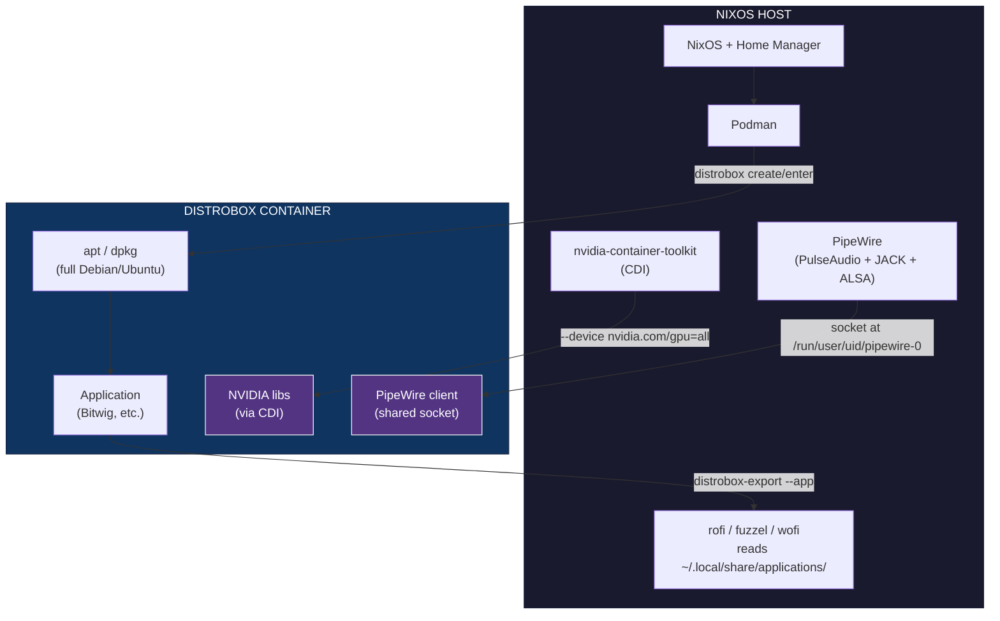

# Distrobox Containers on NixOS: Isolated Software with GPU & Audio

> Running Debian/Ubuntu packages on NixOS in containerized environments with NVIDIA GPU passthrough and PipeWire audio — without touching the host system.

---

## Table of Contents

1. [Why Distrobox on NixOS](#why-distrobox-on-nixos)
2. [Architecture Overview](#architecture-overview)
3. [NixOS Prerequisites](#nixos-prerequisites)
4. [Creating Containers](#creating-containers)
5. [GPU Passthrough via CDI](#gpu-passthrough-via-cdi)
6. [Audio: PipeWire & JACK](#audio-pipewire--jack)
7. [Installing Software Inside Containers](#installing-software-inside-containers)
8. [Desktop Integration (Exporting Apps)](#desktop-integration-exporting-apps)
9. [File Access & Modification](#file-access--modification)
10. [Isolation & Home Directories](#isolation--home-directories)
11. [Real-Time Audio Scheduling](#real-time-audio-scheduling)
12. [MIDI & Audio Interfaces](#midi--audio-interfaces)
13. [Example: Bitwig Studio](#example-bitwig-studio)
14. [GUI Managers](#gui-managers)
15. [Troubleshooting](#troubleshooting)
16. [Quick Reference](#quick-reference)
17. [References](#references)

---

## Why Distrobox on NixOS

NixOS is declarative and immutable — great for reproducibility, but sometimes you just need `apt install`. Distrobox bridges this gap:

- **Full apt/dnf/pacman** inside containers (Debian, Ubuntu, Fedora, Arch, etc.)
- **GPU access** via NVIDIA Container Toolkit CDI
- **Audio** via shared PipeWire socket (no extra config)
- **GUI apps** export to host desktop launchers (rofi, fuzzel, wofi)
- **Isolated** from NixOS — install anything without affecting the host
- **Shared home** (optional) — files and configs can be accessible across host/container

### When to use this

| Use Case | Approach |
|----------|----------|
| Software with `.deb`/`.rpm` packages | Distrobox |
| DAW, audio production, VST plugins | Distrobox with GPU + audio |
| Running proprietary Linux binaries | Distrobox or `steam-run` |
| One-off binary with missing libs | `nix-alien` or `nix-ld` |
| Full OS isolation (VM-level) | QEMU/KVM |

---

## Architecture Overview



### How it works

1. **Podman** runs OCI containers (Docker-compatible, daemonless, rootless)
2. **Distrobox** wraps Podman with host integration (home dir, X11/Wayland, audio, display export)
3. **NVIDIA CDI** passes GPU device nodes + driver libraries into the container
4. **PipeWire** shares its socket with the container via `$XDG_RUNTIME_DIR`
5. **distrobox-export** creates `.desktop` files that the host launcher picks up

---

## NixOS Prerequisites

These must be enabled in the NixOS config. Our setup already has them:

### nixos/configuration.nix

```nix
# Podman (container runtime)
virtualisation.podman.enable = true;

# NVIDIA Container Toolkit (CDI GPU passthrough)
hardware.nvidia-container-toolkit.enable = true;
```

### home-manager/home.nix

```nix
home.packages = with pkgs; [
  # ... other packages ...
  distrobox  # in the CONTAINERS section
];
```

### Rebuild after adding prerequisites

```bash
make flake   # system rebuild + home-manager
```

### Verify

```bash
which distrobox        # should return a path
podman --version       # should show version
nvidia-ctk cdi list    # should show nvidia.com/gpu devices
```

---

## Creating Containers

### Basic syntax

```bash
distrobox create \
  --name <container-name> \
  --image <distro-image> \
  [options]
```

### Common images

| Image | Command | Notes |
|-------|---------|-------|
| Debian 13 (trixie) | `docker.io/library/debian:trixie` | Recommended — modern packages, stable |
| Debian 12 (bookworm) | `docker.io/library/debian:bookworm` | LTS, older but rock-solid |
| Ubuntu 24.04 | `docker.io/library/ubuntu:24.04` | Good for Ubuntu-specific software |
| Fedora 42 | `registry.fedoraproject.org/fedora-toolbox:42` | Cutting-edge packages |
| Arch | `ghcr.io/ublue-os/arch-toolbox:latest` | Rolling release |

### Example: Debian trixie with GPU

```bash
distrobox create \
  --name mycontainer \
  --image docker.io/library/debian:trixie \
  --additional-flags "--device nvidia.com/gpu=all --security-opt=label=disable" \
  --additional-packages "wget ca-certificates sudo"
```

### With isolated home directory

```bash
distrobox create \
  --name mycontainer \
  --image docker.io/library/debian:trixie \
  --additional-flags "--device nvidia.com/gpu=all --security-opt=label=disable" \
  --home ~/.mycontainer-home
```

### Managing containers

```bash
distrobox list                 # list all containers
distrobox enter <name>         # shell into container
distrobox rm <name>            # delete container
distrobox stop <name>          # stop container
distrobox stop --all           # stop all containers
```

---

## GPU Passthrough via CDI

### The NixOS problem

The `distrobox --nvidia` flag is **broken on NixOS**. It detects NVIDIA libraries via FHS paths (`/usr/lib/x86_64-linux-gnu/libnvidia*`) which don't exist in NixOS's Nix store layout.

### The workaround: NVIDIA Container Toolkit CDI

CDI (Container Device Interface) passes GPU device nodes directly into the container:

```bash
# Generate CDI spec (usually auto-generated by nvidia-cdi-refresh service)
sudo nvidia-ctk cdi generate --output=/var/run/cdi/nvidia.yaml

# Create container with CDI
distrobox create \
  --name mycontainer \
  --image docker.io/library/debian:trixie \
  --additional-flags "--device nvidia.com/gpu=all --security-opt=label=disable"
```

**Key flags:**
- `--device nvidia.com/gpu=all` — injects GPU device nodes + NVIDIA driver libraries
- `--security-opt=label=disable` — disables SELinux separation (required for CDI device access)

### Verify GPU inside container

```bash
distrobox enter mycontainer

nvidia-smi        # should show your GPU
glxinfo | head -5 # should show "OpenGL vendor: NVIDIA Corporation"
```

### Gotcha: CDI hook permission denied

If the CDI hook fails inside the container (overlay filesystem issue), a workaround is to mount NVIDIA libraries manually:

```bash
# Find the nix store path for nvidia libraries
ls /run/opengl-driver/lib/libGL*

# Mount into container when creating
--volume /run/opengl-driver:/usr/lib/x86_64-linux-gnu:ro
```

---

## Audio: PipeWire & JACK

### How it works

Distrobox automatically mounts `$XDG_RUNTIME_DIR` (typically `/run/user/<uid>/`) into the container. This makes the host's PipeWire socket accessible:

```
/run/user/1000/pipewire-0    ← PipeWire socket (shared)
/run/user/1000/pulse/native  ← PulseAudio compatibility socket (shared)
```

The container does **not** run its own PipeWire daemon — it connects to the host's daemon as a client.

### Install audio client libraries inside the container

```bash
# Inside the container
sudo apt install -y \
  pipewire \
  pipewire-pulse \
  wireplumber \
  libjack-jackd2-0 \
  libasound2-plugin-jack \
  alsa-utils \
  libasound2
```

### Verify audio

```bash
# Check PipeWire socket is accessible
ls -la $XDG_RUNTIME_DIR/pipewire-0

# Check JACK connectivity
jack_lsp

# Test playback
speaker-test -c 2 -t wav
```

### JACK specifically

PipeWire's JACK emulation layer (`pipewire-jack`) makes JACK applications work transparently. You don't need to run `jackd` — PipeWire handles it. The JACK IPC protocol is version-sensitive, but as long as the container's `libjack` is recent (Debian trixie has PipeWire 1.x compatible JACK), it works.

---

## Installing Software Inside Containers

### Standard apt workflow

```bash
distrobox enter mycontainer

# Update
sudo apt update && sudo apt upgrade -y

# Install software
sudo apt install -y <package-name>

# Install from .deb file
sudo dpkg -i /path/to/package.deb
sudo apt install -f -y  # fix missing dependencies
```

### Copying files into containers

Use `podman cp` from the host (not bind mounts, which can be unreliable):

```bash
# Copy a file from host to container
podman cp /host/path/file.deb container-name:/container/path/

# Copy from container to host
podman cp container-name:/container/path/file /host/path/
```

### Installing from local .deb files

```bash
# From host: copy .deb into container
podman cp ./package.deb mycontainer:/tmp/

# Inside container: install
distrobox enter mycontainer
sudo dpkg -i /tmp/package.deb
sudo apt install -f -y  # resolve dependencies
```

### 32-bit (i386) packages

Some software (like Bitwig) requires 32-bit libraries:

```bash
# Inside container
sudo dpkg --add-architecture i386
sudo apt update
sudo apt install -y <package>:i386
```

---

## Desktop Integration (Exporting Apps)

### Exporting a GUI application

Run **inside the container**:

```bash
distrobox-export --app <app-name>
```

This creates a `.desktop` file in `~/.local/share/applications/` on the host. The desktop entry wraps the launch command with `distrobox-enter` so clicking the icon in rofi/fuzzel/wofi launches the app inside the container transparently.

### What the .desktop file looks like

```ini
[Desktop Entry]
Name=Bitwig Studio (on bitwig)
Exec=/home/cavelasco/.nix-profile/bin/distrobox-enter -n bitwig -- bitwig-studio
Icon=bitwig
Type=Application
Categories=Audio;
```

### Exporting a CLI binary

```bash
# Inside container
distrobox-export --bin /usr/local/bin/mytool --export-path ~/.local/bin
```

This creates a wrapper script in `~/.local/bin/mytool` on the host that transparently routes execution to the container.

### Un-exporting

```bash
# Inside container
distrobox-export --app <app-name> --delete
distrobox-export --bin /usr/local/bin/mytool --delete
```

### Auto-generate desktop entry for container itself

```bash
distrobox generate-entry container-name
```

Creates a `.desktop` file that opens a terminal into the container.

---

## File Access & Modification

### Default behavior

Distrobox containers mount the host's home directory (`$HOME`) by default. Files created on the host are visible in the container and vice versa.

### Using isolated home

```bash
distrobox create --name mycontainer --image debian:trixie --home ~/.mycontainer-home
```

With `--home`, the container gets its own private home directory. The host's `$HOME` is **not** mounted.

### Accessing files across host/container

| Method | Command | Use case |
|--------|---------|----------|
| Shell into container | `distrobox enter mycontainer` | Interactive work |
| Copy file in | `podman cp file.txt mycontainer:/path/` | Transfer files |
| Copy file out | `podman cp mycontainer:/path/file.txt .` | Retrieve files |
| One-liner command | `distrobox enter mycontainer -- ls /opt/` | Quick commands |
| Bind mount | `--volume /host:/container:rw` at create time | Persistent shared paths |

### Modifying files inside the container

Containers are fully editable with sudo. You can:
- Edit config files: `sudo vim /etc/some-config`
- Install packages: `sudo apt install ...`
- Run services: `sudo systemctl start ...` (if systemd container)
- Modify application binaries: `sudo cp bitwig.jar /opt/app/`

---

## Isolation & Home Directories

### Shared home (default)

```bash
distrobox create --name mycontainer --image debian:trixie
```

The host's `$HOME` is bind-mounted into the container. This means:
- Config files (`.config/`, `.local/`) are shared
- Downloads, documents, etc. are shared
- Changes on one side are visible on the other

### Isolated home

```bash
distrobox create --name mycontainer --image debian:trixie --home ~/.mycontainer-home
```

Each container gets its own home. Useful for:
- Running multiple instances of the same software
- Keeping container configs separate from host
- Clean uninstall (just delete the home dir)

### Podman storage

Container images and layers are stored at:
```
~/.local/share/containers/
```

---

## Real-Time Audio Scheduling

### Does it work inside containers?

**Yes.** Here's why:

1. The host NixOS config sets PAM limits for the `@audio` group:
   ```nix
   security.pam.loginLimits = [
     { domain = "@audio"; type = "-"; item = "rtprio"; value = "99"; }
     { domain = "@audio"; type = "-"; item = "memlock"; value = "unlimited"; }
   ];
   ```

2. Your user is in the `audio` group.

3. Distrobox mounts `/etc/security` from the host, so PAM limits apply inside the container.

4. The kernel parameter `kernel.sched_rt_runtime_us = -1` removes the RT throttle limit.

### Verify inside the container

```bash
ulimit -r    # should show: 99
ulimit -l    # should show: unlimited
```

---

## MIDI & Audio Interfaces

### Device access

Distrobox shares the host's `/dev` directory by default. This includes:
- `/dev/snd/*` — ALSA devices (MIDI rawmidi, sequencer, PCM)
- USB MIDI controllers — accessible via USB device passthrough
- Audio interfaces — accessible via ALSA devices

### Host kernel modules

The host loads the needed modules automatically:
```nix
boot.kernelModules = [ "snd-seq" "snd-rawmidi" ];
```

- `snd-seq` — ALSA sequencer (MIDI routing)
- `snd-rawmidi` — raw MIDI device access

### Verify inside container

```bash
ls /dev/snd/           # should show cards, devices, timers
cat /proc/asound/cards # should list audio devices
```

### Explicit device passthrough (if needed)

```bash
distrobox create \
  --name mycontainer \
  --image debian:trixie \
  --volume /dev/snd:/dev/snd:rwx
```

---

## Example: Bitwig Studio

### Full walkthrough

```bash
# 1. Create container with GPU
distrobox create \
  --name bitwig \
  --image docker.io/library/debian:trixie \
  --additional-flags "--device nvidia.com/gpu=all --security-opt=label=disable" \
  --home ~/.bitwig-home

# 2. Enter container
distrobox enter bitwig

# 3. Install dependencies
sudo apt update && sudo apt upgrade -y
sudo apt install -y \
  wget ca-certificates sudo \
  libx11-xcb1 libx11-6 libxcb-icccm4 libxcb-util1 libxcb-shm0 \
  libxcb-xinput0 libxcb-xkb1 libxcb-render0 libxcb-randr0 \
  libxkbcommon0 libxkbcommon-x11-0 libxcb-ewmh2 libxcb-xfixes0 \
  libpixman-1-0 libcairo2 libfreetype6 libxfixes3 libexpat1 \
  pipewire pipewire-pulse wireplumber \
  libjack-jackd2-0 libasound2-plugin-jack alsa-utils \
  libgl1 libegl1 libglu1-mesa \
  fonts-noto fonts-liberation xdg-utils

# 4. Add user to audio group
sudo usermod -aG audio "$USER"

# 5. Enable i386 for 32-bit libs (Bitwig requires them)
sudo dpkg --add-architecture i386
sudo apt update

# 6. Install Bitwig .deb
# From host: podman cp /path/to/bitwig-studio.deb bitwig:/tmp/
sudo dpkg -i /tmp/bitwig-studio.deb
sudo apt install -f -y

# 7. Install any missing i386 deps
sudo apt install -y libxcb-imdkit1:i386  # or whatever dpkg reports

# 8. Export to host launcher
distrobox-export --app bitwig-studio
```

### Launch from host

```bash
# From rofi/launcher: click "Bitwig Studio"
# From terminal:
distrobox enter bitwig -- bitwig-studio
```

### Container details

| Property | Value |
|----------|-------|
| Container name | `bitwig` |
| Image | `docker.io/library/debian:trixie` |
| Container home | `~/.bitwig-home/` |
| App binary | `/opt/bitwig-studio/BitwigStudio` |
| Host launcher | `~/.local/share/applications/bitwig-*.desktop` |
| Podman storage | `~/.local/share/containers/` |

---

## GUI Managers

These provide graphical interfaces for managing distrobox containers:

| Tool | Tech | Install | Notes |
|------|------|---------|-------|
| **BoxBuddyRS** | GTK4/Libadwaita | Flatpak on Flathub | Most mature GUI |
| **Kontainer** | Kirigami (KDE) | Flatpak on Flathub | Native KDE integration |
| **DistroShelf** | GTK4/Libadwaita | Flatpak | Bluefin default manager |
| **DistroRack** | Qt6/QML | GitHub build | DDE/KDE native |
| **Podman Desktop** | Electron | Flathub | General Podman manager (sees distrobox containers) |
| **Ptyxis** | GTK4 terminal | GNOME ecosystem | Terminal with container-aware tabs |

All export `.desktop` files to `~/.local/share/applications/` which rofi/wofi/fuzzel read automatically.

---

## Troubleshooting

### "nvidia-smi: command not found" inside container

The CDI spec may not be generated. Run on host:
```bash
sudo nvidia-ctk cdi generate --output=/var/run/cdi/nvidia.yaml
```

Or the CDI hook is failing. Try mounting NVIDIA libs manually:
```bash
distrobox rm mycontainer
distrobox create \
  --name mycontainer \
  --image debian:trixie \
  --additional-flags "--device nvidia.com/gpu=all --security-opt=label=disable" \
  --volume /run/opengl-driver:/usr/lib/x86_64-linux-gnu:ro
```

### No audio inside container

1. Check PipeWire socket is accessible:
   ```bash
   ls -la $XDG_RUNTIME_DIR/pipewire-0
   ```
2. Install PipeWire client libraries:
   ```bash
   sudo apt install pipewire pipewire-pulse
   ```
3. Restart the container:
   ```bash
   distrobox stop mycontainer && distrobox enter mycontainer
   ```

### Exported app doesn't appear in launcher

Check the `.desktop` file exists:
```bash
ls ~/.local/share/applications/*myapp*
```

If missing, run the export again inside the container:
```bash
distrobox-export --app myapp
```

### Container can't find NVIDIA GPU

Check the CDI spec:
```bash
nvidia-ctk cdi list
# Should show: nvidia.com/gpu=all, nvidia.com/gpu=0
```

### "Permission denied" when running nvidia-cdi-hook

The CDI hook may fail due to overlay filesystem permissions. Workaround:
```bash
# On host, find the nvidia driver store path
ls /run/opengl-driver/lib/

# Mount it into the container
--volume /run/opengl-driver:/usr/lib/x86_64-linux-gnu:ro
```

### Slow container startup

Distrobox rebuilds the container from the base image on `distrobox create`. First create is slow; subsequent starts are fast. If `distrobox enter` is slow, check:
```bash
podman ps -a   # container should be "running" or "exited"
podman start mycontainer  # manually start if stopped
```

---

## Quick Reference

```bash
# --- Container management ---
distrobox create --name NAME --image IMAGE [options]
distrobox list
distrobox enter NAME
distrobox rm NAME
distrobox stop NAME

# --- GPU passthrough ---
--additional-flags "--device nvidia.com/gpu=all --security-opt=label=disable"

# --- File transfer ---
podman cp file.txt NAME:/path/       # host → container
podman cp NAME:/path/file.txt .      # container → host

# --- Desktop integration ---
distrobox-export --app APP-NAME      # export GUI app
distrobox-export --bin /path/to/bin  # export CLI tool
distrobox-export --app APP --delete  # un-export

# --- Isolation ---
--home ~/.container-home              # isolated home directory
--volume /host:/container:rw          # bind mount

# --- Debugging ---
nvidia-ctk cdi list                  # check CDI spec
ls $XDG_RUNTIME_DIR/pipewire-0       # check audio socket
podman logs NAME                      # container logs
```

---

## References

- [Distrobox documentation](https://distrobox.it)
- [Distrobox usage guide](https://distrobox.it/usage/distrobox)
- [Distrobox-export guide](https://distrobox.it/usage/distrobox-export)
- [NVIDIA Container Toolkit CDI](https://docs.nvidia.com/datacenter/cloud-native/container-toolkit/latest/cdi-support.html)
- [NixOS nvidia-container-toolkit issue](https://github.com/NixOS/nixpkgs/issues/412324)
- [NixOS distrobox NVIDIA issue](https://github.com/NixOS/nixpkgs/issues/241316)
- [PipeWire wiki](https://pipewire.org)
- [BitwigBox project](https://github.com/xynydev/BitwigBox)

---

*Last updated: 2026-09-17*
